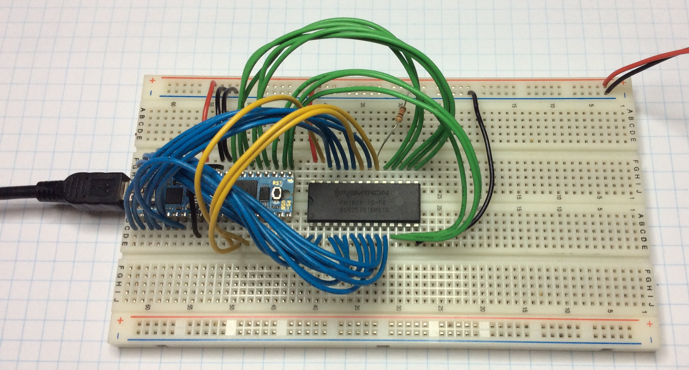
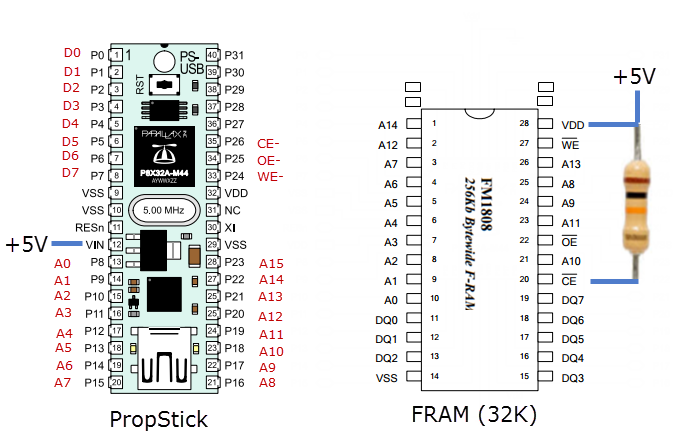
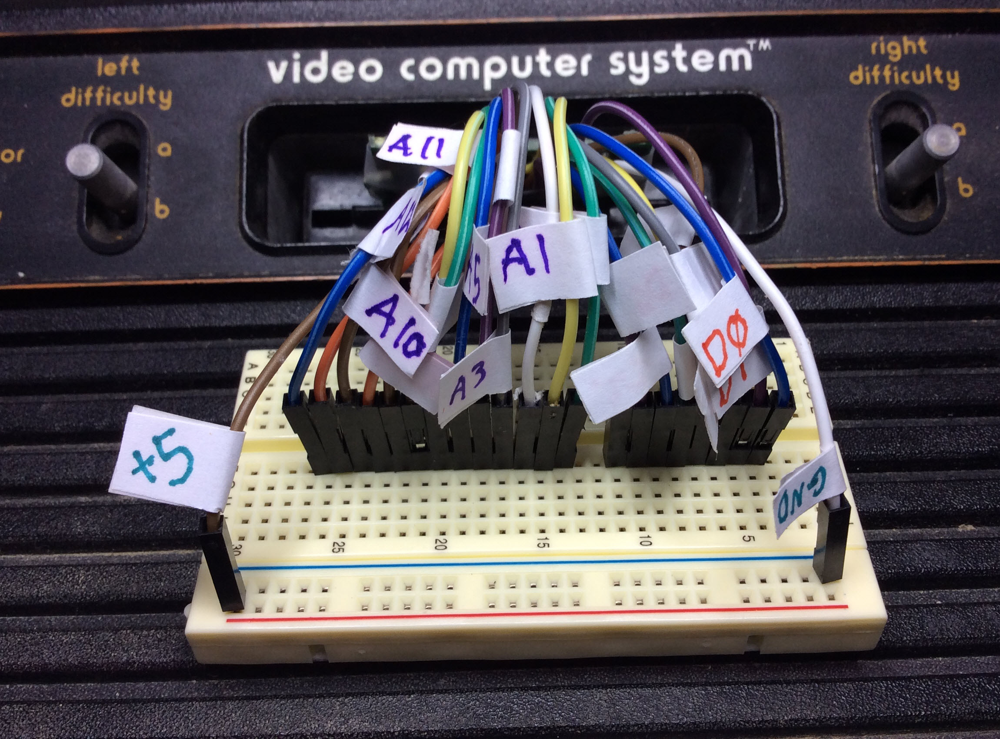
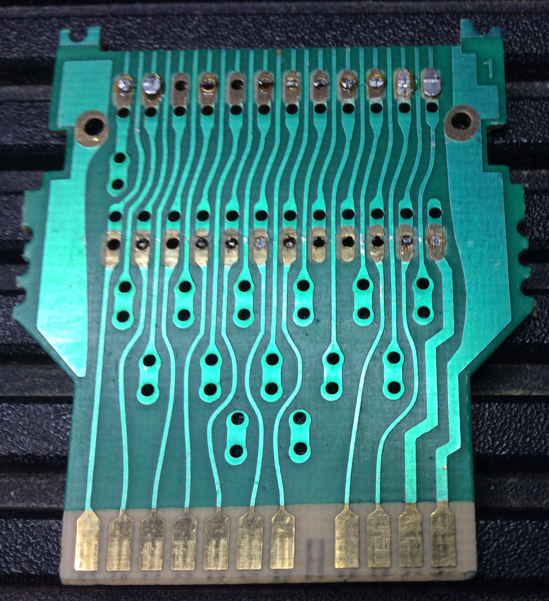
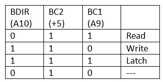
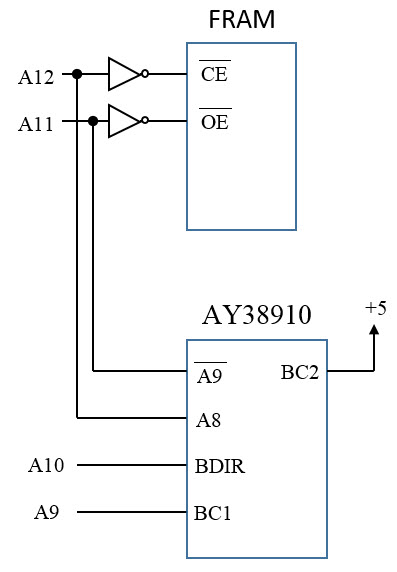
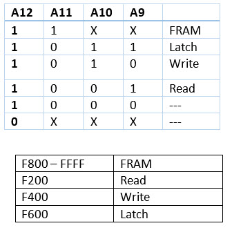

# Atari2600-Sound-Card
Custom cartridge with AY38010 sound chip.

## Links

[http://f.rdw.se/AY-3-8910-datasheet.pdf](http://f.rdw.se/AY-3-8910-datasheet.pdf)

[https://www.mdawson.net/vic20chrome/cpu/mos_6500_mpu_preliminary_may_1976.pdf](https://www.mdawson.net/vic20chrome/cpu/mos_6500_mpu_preliminary_may_1976.pdf)

[https://hackaday.io/contest/18215-the-1kb-challenge](https://hackaday.io/contest/18215-the-1kb-challenge)

[https://hackaday.io/project/18536-atari2600-sound-cartridge](https://hackaday.io/project/18536-atari2600-sound-cartridge)

[http://datasheet.octopart.com/FM1808-70-PG-Ramtron-datasheet-8328945.pdf](http://datasheet.octopart.com/FM1808-70-PG-Ramtron-datasheet-8328945.pdf)

## FRAM Programmer

The FRAM programmer is from my [https://github.com/topherCantrell/GameBoyColor-Development](GameBoy programming project).

The chip on the left is a Parallax PropStick USB. The chip on the right is the FRAM 1808 chip. A java program sends data to the propstick over
the the USB serial port. The propstick bit-bangs the FRAM chip's pins to program the RAM. The SPIN code (propstick) and the java code are in the repository.

Here is how the programmer is wired.

## Hardware

Before I make a custom board, I'll breadboard everything. I pulled the ROM off an Asteroids cartridge board
and soldered on break-out wires. From right to left: GND, D0-D7, A0-A12, 5V. 

This is a close-up of a Combat cartridge board without the ROM. Notice the missing A11 pin. The Combat game
is only 2K bytes.

AY38910 control signals:

Mapping the AY38910 and the FRAM into the memory space:

